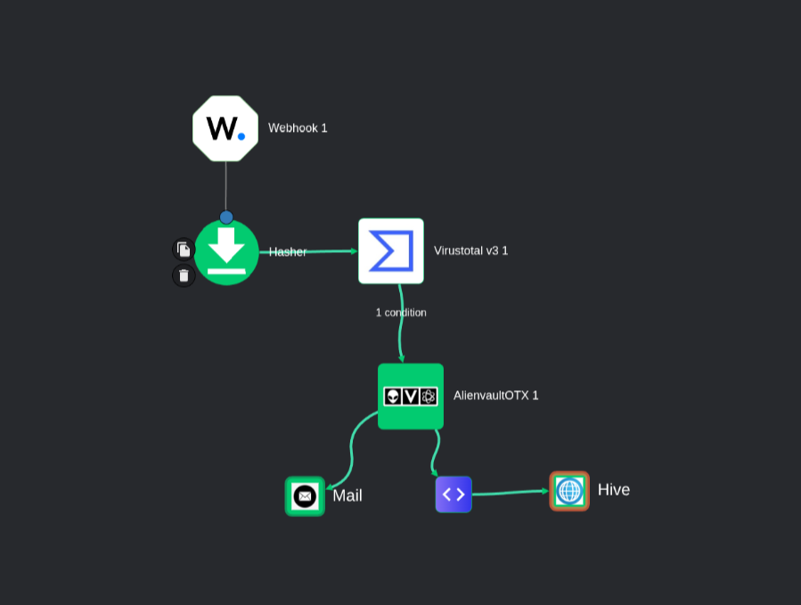

# SOC AUTOMATION SUITE (Wazuh + Shuffle + TheHive + OTX)


-lightgrey)


> **TL;DR**
> Detect file drops (Downloads) via **Sysmon** (with SHA256), alert via **Wazuh**, enrich in **Shuffle** (VirusTotal + OTX), create cases in **TheHive** , and notify via **email**. Extensions watched: `exe, vbs, scr, js, bat`.


## Introduction

An end-to-end SOC automation that flags suspicious file drops on Windows, enriches them with threat intel, and opens actionable cases automatically. **Sysmon EID 15** generates file hashes on creation; **Wazuh** raises a custom alert (**100011**) when targeted extensions land in `C:\Users\*\Downloads\`. **Shuffle (SaaS)** queries **VirusTotal (free API)** and **AlienVault OTX** (pulse count), then **POSTs** a case into **TheHive** (local Docker). A **Shuffle Email** notification summarizes IOCs and enrichment.

---

## Key features

* **Hash-aware detection**: Uses **EID 15 (FileCreateStreamHash)** so **SHA256** is available at detection time.
* **Targeted scope**: Defaults to **Downloads** with extensions: `exe | vbs | scr | js | bat` (easy to extend to other directories).
* **Wazuh custom rule**: **`100011`** triggers on matched events and forwards to Shuffle.
* **Enrichment pipeline**:

  * **VirusTotal (free)**:  malicious count & metadata.
  * **OTX**: general indicator lookup → **pulse count** (quick risk signal).
* **Case creation**: **TheHive** via **HTTP POST** (Bearer token).
* **Notification**: **Shuffle Email** with SHA256, VT malicious count, OTX pulse count, and description.
* **MITRE tagging**: Includes `T1204.002` (User Execution: Malicious File) and `Sysmon Event ID 15`.

---

## Architecture
  
<sub>*Lab environment architecture*</sub>

---

## Tested environment

* **Sysmon**: `15.15` 
* **Wazuh (OVA)**: `4.12.0` 
* **TheHive**: `4.1.24-1`
* **Shuffle**: SaaS (`shuffler.io`)
* **Windows host**: **8.1 (Lab)**

---

## Next sections

* [Setup & Requirements](#)
* [Sysmon & Wazuh Configs](#)
* [Shuffle Workflows (VT + OTX)](#)
* [TheHive Case Template (HTTP POST)](#)
* [Email Alert Template](#)
* [Conclusion](#)

---
## Setup & Requirements

> **TL;DR**  
>  Windows endpoint with Sysmon → Wazuh OVA  → Shuffle SaaS (via local Orborus) → TheHive on Local Server.  
> All systems are established locally in the same subnet: **192.168.1.0/24**.

---

### 1. Windows Endpoint (Sysmon)

- OS: Windows 8.1 (lab)  
- Install [Sysmon](https://learn.microsoft.com/en-us/sysinternals/downloads/sysmon)  
- Base config: [SwiftOnSecurity/sysmon-config](https://github.com/SwiftOnSecurity/sysmon-config)  
- Ensure **Event ID 15 (FileCreateStreamHash)** is enabled  with Hashing **SHA256**  
- Scope: monitor `C:\Users\*\Downloads\`  
- Targeted file extensions triggering alerts: `exe | vbs | scr | js | bat`  

---

### 2. Wazuh Manager (OVA)

- VM1: Amazon Linux Server 2023
- Install [Wazuh OVA](https://documentation.wazuh.com/current/deployment-options/virtual-machine/virtual-machine.html)  
- Wazuh OVA appliance deployed at **192.168.1.10**  
- Wazuh Agent installed on the Windows endpoint  

---

### 3. TheHive Server (Docker)

- VM2: Ubuntu Server host  
- TheHive deployed in Docker at **192.168.1.11:9000**  
- Authentication: **Bearer token**  
- API endpoint used: `POST http://192.168.1.11:9000/api/v1/alert`  
- Integration point: Shuffle HTTP node sends case JSON directly  

---

### 4. Shuffle (SaaS + Local Orborus)

- SaaS account at [shuffler.io](https://shuffler.io)  
- Orborus container deployed on **Primary Host (Debian 13 in this case)** to bridge SaaS ↔ local TheHive
- Orburos container can be setup by adding a new location in Shuffle Settings 
  
- Orborus command (example):

```bash
docker rm shuffle-orborus --force; \
docker run -d \
    --restart=always \
    --name="shuffle-orborus" \
    --pull=always \
    --volume "/var/run/docker.sock:/var/run/docker.sock" \
    -e AUTH="*********************************" \
    -e ENVIRONMENT_NAME="Home" \ 
    -e ORG="**********************************" \
    -e BASE_URL="https://shuffle-backend-stbuwivzoq-nw.a.run.app" \
    ghcr.io/shuffle/shuffle-orborus:latest
```
- Replace the placeholder with actual `AUTH KEYS` found in Locations section on Shuffle 

---
### 5. Enrichment APIs

- **VirusTotal v3 (free tier) - Gets hash report**  
  - **Endpoint:** `/api/v3/files/{id}`  
  - **Returns:** Malicious detection count, metadata 

- **AlienVault OTX**  
  - **Endpoint:** `/api/v1/indicators/file/{hash}/{section}`  
  - **Returns:** `pulse_info.count`, campaigns, pulse names  

---

### Network Topology

⚠️ Ensure both VM1 (Wazuh OVA) and VM2 (TheHive) are configured with **static IPs** on `192.168.1.0/24` to avoid breaking integrations.


- `192.168.1.0/24`
  - `192.168.1.10` → **VM1 Wazuh OVA** (Amazon Linux 2023)
  - `192.168.1.11` → **VM2 Ubuntu Server** + **TheHive** (Docker)
  - Followed by Windows Agent and Debian

---

## Sysmon & Wazuh Configs

### 1. Sysmon Setup (Windows 8.1)
- Install [Sysmon](https://learn.microsoft.com/en-us/sysinternals/downloads/sysmon) with the [SwiftOnSecurity base config](https://github.com/SwiftOnSecurity/sysmon-config).
- On the Windows 8.1 endpoint, edit the **Wazuh Agent config** (`ossec.conf`) using an elevated PowerShell session to make sure Sysmon event logs are being forwarded:
```
    notepad "C:\Program Files (x86)\ossec-agent\ossec.conf"

    <localfile>
        <location>Microsoft-Windows-Sysmon/Operational</location>
        <log_format>eventchannel</log_format>
    </localfile>    
```

---

### 2. Wazuh Custom Rule (100011)
Add this custom rule to detect suspicious file drops in the **Downloads** directory.

#### Steps:
- In the Wazuh Manager UI → **Server Management -> Rules -> Manage Rules Files→ local_rules.xml**     (OR)    SSH into the Wazuh server and edit directly:

```bash
sudo nano /var/ossec/etc/rules/local_rules.xml
```
- Insert the following block (ensure the rule ID doesn’t conflict with existing rules):


```bash
<group name="sysmon_downloads">
  <rule id="100011" level="5">
    <if_group>sysmon</if_group>
    <field name="win.system.eventID">15</field>
    <field name="win.eventdata.targetFilename" type="pcre2">\\\\Downloads\\\\.*\.(exe|bat|vbs|scr|js)$</field>
    <description>File hash recorded for file dropped in Downloads</description>
    <mitre>
      <id>T1204.002</id>
    </mitre>
  </rule>
</group>

```

- Restart Wazuh Manager: `sudo systemctl restart wazuh-manager`
---
### 3. Wazuh → Shuffle Integration
To forward matching alerts to Shuffle.

#### Steps:
- Edit Wazuh `ossec.conf` on the Manager:
```bash
sudo nano /var/ossec/etc/ossec.conf
```

- Add this integration block (replace with your Shuffle Trigger webhook URL):
```xml
<integration>
  <name>shuffle</name>
  <hook_url>https://shuffler.io/api/v1/hooks/<your-webhook-id></hook_url>
  <rule_id>100011</rule_id>
  <alert_format>json</alert_format>
</integration>
```

- Save and exit & Restart the Wazuh Manager:
```bash
sudo systemctl restart wazuh-manager
```
---

### 4. Verify Alert Flow
Test that alerts are being generated correctly after configuring the integration.

#### Steps:
- **Generate a test event**
  - Drop a file (e.g., `test.exe`, `malicious.js`) into:
    ```
    C:\Users\<your_user>\Downloads\
    ```
  - Sysmon should log **Event ID 15** with the file’s SHA256 hash.

- **Check Wazuh alerts**
  - Go to **Wazuh dashboard** → **Security events**
  - Filter by `rule.id:100011`
  - Confirm the file creation alert appears.

  
<sub>*Wazuh dashboard showing rule 100011 cause of Sysmon Event ID 15.*</sub>

✅  This validates :  
- Sysmon is generating Event ID 15 with file hashes.  
- Wazuh is receiving those logs and triggering your custom rule (`100011`).  
- Alerts are visible in the Wazuh dashboard (`wazuh-alerts-*` index)

--- 
## Shuffle Workflows (VT + OTX)

This workflow takes Wazuh alerts, enriches them, and forwards results to TheHive and Email.

**Flow:**  
Webhook (Wazuh) → Hasher → VirusTotal v3 → Condition (hash exists) → AlienVault OTX → TheHive (HTTP POST) + Mail

**Workflow diagram:**  
  
<sub>*Shuffle workflow connecting Wazuh → VirusTotal → OTX → TheHive → Email.*</sub>

**Nodes used:**
- **Webhook**: Receives alerts from Wazuh.  
- **Hasher**: Extracts SHA256 from alert.  
- **VirusTotal v3**: Checks hash, returns detection count + metadata.  
- **Condition**: Ensures SHA256 is present before enrichment.  
- **AlienVault OTX**: Queries pulse data for the hash.
- **Time**: Executes Python for epoch.
- **TheHive**: Creates a case via HTTP POST with enrichment results.  
- **Mail**: Sends IOC summary email.

  
<sub>*Shuffle run showing enrichment results and successful case forwarding.*</sub>

---
## TheHive Case Template (HTTP POST)

Alerts enriched in Shuffle are forwarded to **TheHive** to create actionable cases.  
This is done using an **HTTP POST** node in the workflow, pointing to your local TheHive instance.

**Endpoint:**  
`http://192.168.1.11:9000/api/v1/alert`

**Auth Header:**  
`Authorization: Bearer <YOUR_API_KEY>`  
`Content-Type: application/json`

**Sample JSON Body:**
```json
{
  "title": "Malicious File Download Detected",
  "description": "Wazuh detected a suspicious file dropped in Downloads. VirusTotal and AlienVault OTX enrichment available.",
  "type": "malware",
  "source": "Wazuh → Shuffle",
  "sourceRef": "Wazuh - $time.message",
  "severity": 4,
  "tlp": 2,
  "pap": 2,
  "date": "$time.message",
  "tags": [
    "sysmon",
    "eid15",
    "T1204.002",
    "malware",
    "virustotal",
    "alienvault"
  ],
  "status": "New",
  "summary": "Suspicious file detected & SHA256 hash was checked in VirusTotal & AlienVault.",
  "externalLink": "https://www.virustotal.com",
  "flag": false
}
```

**Notes**
- Replace `$time.message` with the correct timestamp variable(select an epoch!) from your Wazuh → Shuffle payload.
- TheHive server must be reachable from Shuffle (via your Orborus setup).
---
#### TheHive Alerts
  
<sub>*Auto-generated case in TheHive with enrichment details.*</sub>

---
## Email Alert Template
The final step uses the **Shuffle Email App** to notify analysts of suspicious file downloads and enrichment results.

**Purpose:**  
Send a clear email containing IOCs, VirusTotal score, and AlienVault OTX context for quick triage.

**Sample Email Body:**
```
This is an automated alert email from wazuh
-------------------------------------------

Wazuh Alert: Malicious File Download Detected

File: 
$virustotal_v3_1.#.body.data.attributes.signature_info.description

SHA256: $virustotal_v3_1.#.body.data.attributes.sha256

VirusTotal Score: $virustotal_v3_1.#.body.data.attributes.last_analysis_stats.malicious

AlienVault OTX Pulses: $alienvaultotx_1.#.body.pulse_info.count

Associated Campaigns:$alienvaultotx_1.#.body.pulse_info.pulses.#.name

----------------------------------------------
```

**Notes:**
- Variables are pulled from **Shuffle enrichment nodes** (VirusTotal v3 and AlienVault OTX).
- Ensure correct field mapping in Shuffle to avoid missing values.  
---
  
<sub>*Automated alert email showing IOCs, VirusTotal, and OTX details.*</sub>

---
## Conclusion

This lab demonstrates how to build an automated SOC workflow from end to end. The environment ties together **Sysmon**, **Wazuh**, **Shuffle**, and **TheHive**, with external enrichment from **VirusTotal** and **AlienVault OTX**. The main results of this setup include:

- A **Windows 8.1 endpoint** generating detailed file activity with Sysmon (EID 15 and SHA256 hashes).  
- A **Wazuh OVA** acting as the central log collector and alert engine, with a custom rule (`100011`) focused on suspicious file drops.  
- A **TheHive instance** on Ubuntu (Docker) handling case creation and structured incident tracking.  
- A **Debian 13 host** running Orborus, bridging Shuffle SaaS with the local TheHive server.  
- Automated enrichment against **VirusTotal** and **OTX**, adding reputation and context to file events.  
- A complete flow: Sysmon → Wazuh → Shuffle → Enrichment → TheHive → Email notification.  

It shows how alerts can move from endpoint telemetry to case creation with context added along the way, all without manual steps.  

Next steps could include adding  
- Adding more directories and file types & integrating other enrichment or TI feeds.  
- Experimenting with response actions such as blocking or quarantine.  
- Iterating workflows as threats and needs change.  


---
